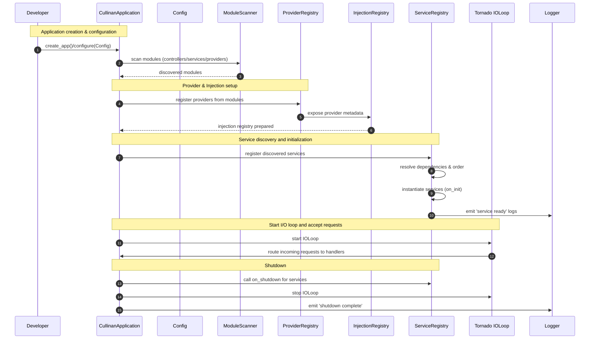

title: "Architecture Overview"
slug: "architecture"
module: ["cullinan.core"]
tags: ["architecture", "ioc", "design"]
author: "TBD"
reviewers: []
status: draft
locale: en
translation_pair: "docs/zh/architecture.md"
related_tests: []
related_examples: []
estimate_pd: 2.5
last_updated: "2025-11-18T00:00:00Z"
pr_links: []

# Architecture Overview

This document presents a source-driven overview of Cullinan's architecture. It is based on implementation facts (source-first): component responsibilities, module interactions, and the startup/request/shutdown sequences. Diagrams are referenced as assets under `docs/work/architecture_assets/` (placeholder).

High-level components

- Core (IoC / DI / lifecycle)
  - Files: `cullinan/core/*` (injection, provider, registry, scope, lifecycle)
  - Responsibility: provide provider abstractions, registries, scopes, and lifecycle orchestration used by services/handlers.

- Service layer
  - Files: `cullinan/service/*`
  - Responsibility: long-lived application services registered by `@service` and orchestrated during startup.

- Controller & Handler
  - Files: `cullinan/controller/*`, `cullinan/handler/*`
  - Responsibility: HTTP handlers, controller decorators, request/response abstractions, and access logging utilities.

- Application & Startup
  - Files: `cullinan/app.py`, `cullinan/application.py`
  - Responsibility: application lifecycle management, service discovery/initialization, IOLoop management and signal handling.

- Middleware & Extensions
  - Files: `cullinan/middleware/*`, `cullinan/*extensions*`
  - Responsibility: pluggable request/response processing and plugin registration points.

Module interaction and dependency flows

- The `app`/`application` module coordinates system startup. It queries registries (service, provider, controller) and initializes components in dependency order.
- Providers and registries are the glue between service definitions and injection points: `ProviderRegistry` supplies instances; `InjectionRegistry` resolves `Inject` markers and constructor injection.
- Controllers/handlers rely on InjectionRegistry to get service instances (either singleton or request-scoped via `RequestScope`).

Startup sequence (summary)

1. Application construction: `create_app()` or `CullinanApplication()` builds basic application object.
2. `startup()` execution:
   - Configure injection: obtain/get InjectionRegistry and prepare provider registries.
   - Discover services and controllers (module scanning or explicit registration).
   - Initialize providers/services in dependency order (call `initialize_all()` / `on_init`).
3. Register signal handlers (SIGINT/SIGTERM) to trigger graceful shutdown.
4. Start the Tornado IOLoop (`IOLoop.start()`), accept requests.

## Startup Sequence (diagram)

```
Application	ModuleScanner	ProviderRegistry	InjectionRegistry	ServiceRegistry	Tornado IOLoop
-----------	-------------	----------------	-----------------	--------------	---------------
create_app() -->	scan() ----> 	register() ---->	add_registry() -->	register_services() --> start()
                                                        |
                                                        |--dispatch--> Handler (controller/handler)
                                                        |               |
                                                        |               |--uses--> Inject/ProviderRegistry -> provides instances

Request Flow (summary):
IOLoop -> create_context() -> resolve request-scoped providers -> Handler executes -> response -> context cleanup

Legend:
- register(): provider registration from discovered modules
- add_registry(): injection registry gets provider registries to resolve inject markers
- register_services(): service discovery and on_init sequence
```

<!--


```mermaid
flowchart LR
  subgraph Core
    IR[InjectionRegistry]
    PV[ProviderRegistry]
    SR[ServiceRegistry]
    SC[Scope (Request/Singleton)]
  end
  App[CullinanApplication] -->|uses| IR
  App -->|registers| PV
  App -->|discovers| SR
  SR -->|depends on| PV
  PV -->|creates instances in| SC
  Controller[Controller/Handler] -->|injects via| IR
  Middleware -->|observes| Controller
  App -->|starts| IOLoop[Tornado IOLoop]
  IOLoop -->|dispatches| Controller
```
-->

Request flow (summary)

1. Incoming request -> Tornado HTTP server -> registered handler lookup via controller registry.
2. Request context created (`create_context()`) to provide `RequestScope` semantics.
3. Injection into handler (property or constructor) resolves via `InjectionRegistry`/`ProviderRegistry`.
4. Handler executes and returns response; response may be processed by middleware.
5. Exit request context and cleanup request-scoped objects.

Key design notes and constraints

- The framework centers IoC/DI in `cullinan/core`; all provider/registry/Scope interactions depend on file-level implementation details — documentation must reflect actual code behavior (not comments).
- Circular dependencies are detected and signaled via `CircularDependencyError` (see `cullinan/core/errors` / exceptions).
- The `ProviderRegistry` and `ServiceRegistry` implement ordering/duplicate policies; consult `docs/work/module_api_summary.json` for generated API summaries.

Where to find artifacts and diagrams

- Diagram assets (placeholder): `docs/work/architecture_assets/` — add sequence and component diagrams here.
- Generated API summaries and candidates: `docs/work/module_api_summary.json`, `docs/work/api_cleanup_candidates.csv`.

Next steps (docs work)

- Add sequence diagrams (Mermaid or PNG) illustrating startup and shutdown flows.
- Expand component pages with code references and short call graphs (using static analysis or grep results).
