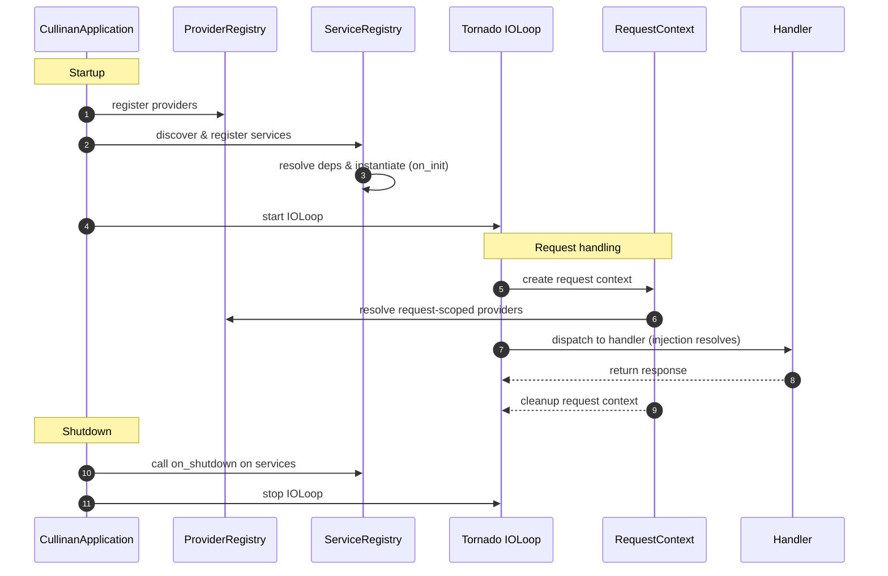
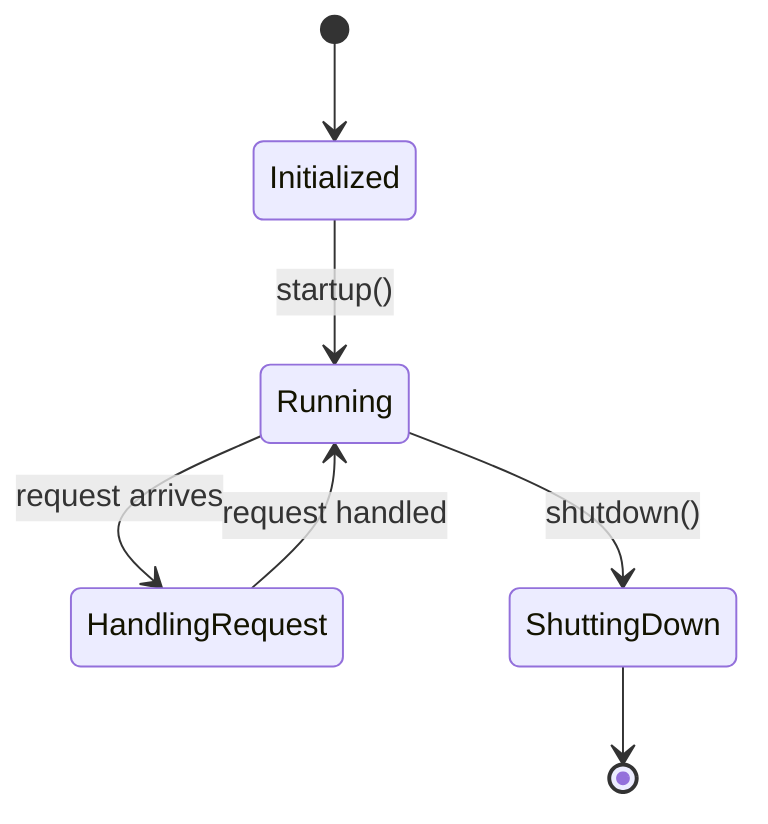

title: "Application Lifecycle"
slug: "lifecycle"
module: ["cullinan.application"]
tags: ["lifecycle", "startup"]
author: "TBD"
reviewers: []
status: draft
locale: en
translation_pair: "docs/zh/wiki/lifecycle.md"
related_tests: ["tests/test_real_app_startup.py","tests/test_comprehensive_lifecycle.py"]
related_examples: ["docs/work/core_examples.py","examples/hello_http.py"]
estimate_pd: 1.5
last_updated: "2025-11-18T15:55:00Z"
pr_links: []

# Application Lifecycle

This document describes the Cullinan application lifecycle: startup, service initialization, request handling, and graceful shutdown hooks and events. The content is derived from the implementation (source-first) and references `cullinan/app.py`, `cullinan/application.py` and `cullinan/core/lifecycle` related files.

Main phases

1. Startup
   - Entry point: `CullinanApplication.run()` or using `create_app()` then calling `app.run()`.
   - Behavior (see `cullinan/app.py`):
     - Calls `startup()` to perform the startup sequence: configure injection (InjectionRegistry), discover services (ServiceRegistry), and initialize services in dependency order.
     - Registers signal handlers (SIGINT / SIGTERM) to trigger graceful shutdown on signals.
     - Starts Tornado's IOLoop: `IOLoop.start()` (blocking until stop event).

2. Service initialization
   - Services register via `@service` or during module scanning into `ServiceRegistry`.
   - `ProviderRegistry` / `ServiceRegistry` instantiate services in dependency order and invoke init hooks (e.g., `on_init`).
   - If no services registered, initialization step is skipped.

3. Request handling & request scope
   - On request arrival, a request context is created (via `create_context()`) to support `RequestScope`.
   - Within the same request context, the RequestScope ensures instances are reused for the lifetime of the request.
   - Handlers (Handler / controller) can obtain request-scoped dependencies via property or constructor injection.

4. Shutdown
   - When the app receives termination signals or a manual shutdown, `shutdown()` is invoked:
     - Executes registered shutdown handlers in order (sync or async); errors are controlled by the `force` flag.
     - Sets `_running` to False and stops the IOLoop.
     - Calls lifecycle hooks (e.g., `on_shutdown`) on services to clean up resources.

Common hooks & extension points

- `CullinanApplication.add_shutdown_handler(handler)` — register custom shutdown handlers (async or sync).
- `LifecycleAware` and `LifecycleManager` (in `cullinan/core`) — services implementing lifecycle interfaces will be called at appropriate times.
- Provider/service `on_init` / `on_shutdown` hooks (if present) — invoked during init and shutdown phases.

Minimal example: registering shutdown handlers

```python
# Quick (recommended): simple entrypoint using the framework module
from cullinan import application

if __name__ == '__main__':
    application.run()

# Advanced (optional): programmatic usage when you need to add shutdown handlers or fine-grained control
from cullinan.app import create_app
import asyncio

application_instance = create_app()

def cleanup_sync():
    print('Running sync cleanup')

async def cleanup_async():
    await asyncio.sleep(0.01)
    print('Running async cleanup')

application_instance.add_shutdown_handler(cleanup_sync)
application_instance.add_shutdown_handler(cleanup_async)

# In process entrypoint call:
# application_instance.run()
```

Request scope example (pseudocode)

```python
from cullinan.core import create_context, RequestScope, ScopedProvider, ProviderRegistry

provider_registry = ProviderRegistry()
provider_registry.register_provider('RequestHandler', ScopedProvider(lambda: RequestHandler(), RequestScope(), 'RequestHandler'))

with create_context():
    handler1 = provider_registry.get_instance('RequestHandler')
    handler2 = provider_registry.get_instance('RequestHandler')
    assert handler1 is handler2

# leaving the context isolates RequestScope instances; next request gets new instances
```

Troubleshooting

- Startup failures: inspect `startup()` error logs (`Application startup failed`) and check service registration/provider initialization stacks.
- Injection/dependency missing: ensure provider is registered in the `ProviderRegistry` and the registry is added to the `InjectionRegistry`.
- Graceful shutdown issues: if a shutdown handler blocks or raises, consider catching errors or using `force=True` during shutdown.

References & next steps

- Source: `cullinan/app.py`, `cullinan/application.py`, `cullinan/core/*` (provider/registry/scope/lifecycle).
- Suggestion: add sequence diagrams illustrating startup and shutdown flows to `docs/wiki/lifecycle.md` for review.

## Lifecycle Sequence (diagram)

```
CullinanApplication    ProviderRegistry    ServiceRegistry    Tornado IOLoop    RequestContext    Handler
-------------------    ----------------    ---------------    ---------------    --------------    -------
startup() -> register providers -> discover & init services -> start IOLoop
                                                        |
                                                        |-> IOLoop receives request -> create RequestContext
                                                        |                             -> resolve request-scoped providers
                                                        |                             -> dispatch to Handler (injection resolves)
                                                        |                             -> Handler returns response
                                                        |                             -> RequestContext cleanup
shutdown() -> call on_shutdown on services -> stop IOLoop
```

<!--



-->
