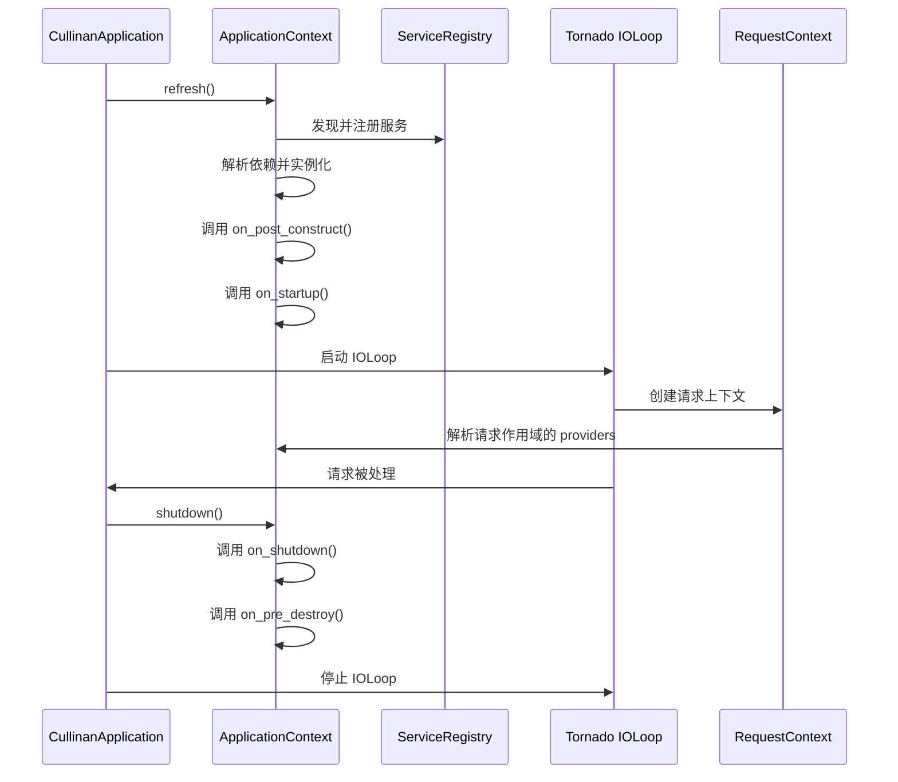
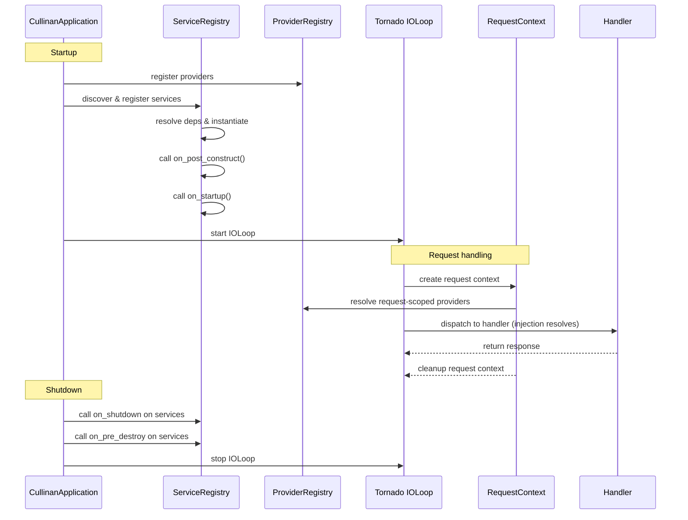
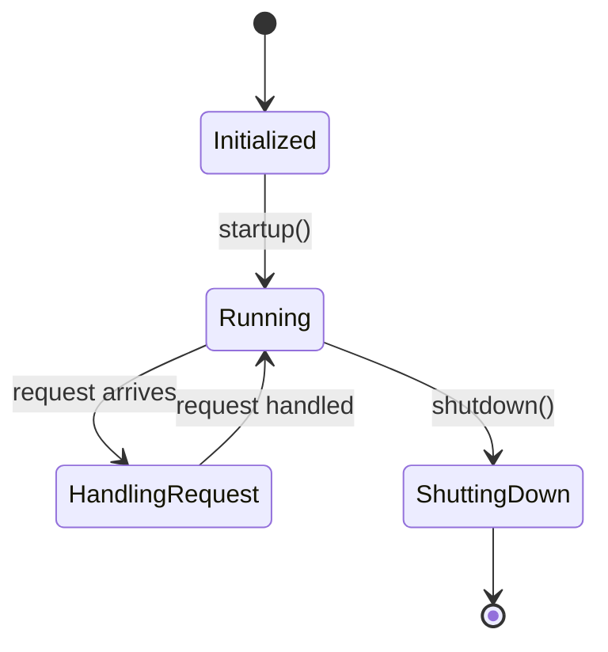

title: "应用生命周期"
slug: "lifecycle"
module: ["cullinan.application"]
tags: ["lifecycle", "startup"]
author: "Plumeink"
reviewers: []
status: updated
locale: zh
translation_pair: "docs/wiki/lifecycle.md"
related_tests: ["tests/test_real_app_startup.py","tests/test_comprehensive_lifecycle.py"]
related_examples: ["docs/work/core_examples.py","examples/hello_http.py"]
estimate_pd: 1.5
last_updated: "2026-02-19T00:00:00Z"
pr_links: []

# 应用生命周期

> **说明（v0.92）**：本文档描述统一的生命周期管理系统。
> 所有组件（`@service`、`@component`、`@controller`）现在使用相同的生命周期钩子。
> `ApplicationContext` 通过 `refresh()` 和 `shutdown()` 提供统一的生命周期管理。

本文档描述 Cullinan 应用的生命周期：启动（startup）、初始化服务（initialize）、请求处理（request handling）、以及优雅关闭（shutdown）钩子与事件。内容基于源码（以实现为准），主要参考：`cullinan/app.py`、`cullinan/application.py` 与 `cullinan/core/lifecycle` 相关实现。

## 统一生命周期钩子（v0.92+）

所有组件现在使用统一的生命周期方法（Duck Typing - 无需继承基类）：

| 钩子方法 | 调用时机 |
|---------|---------|
| `on_post_construct()` | 依赖注入完成后 |
| `on_startup()` | 应用启动时 |
| `on_shutdown()` | 应用关闭时 |
| `on_pre_destroy()` | 销毁前 |

所有钩子均支持异步版本（添加 `_async` 后缀）。

### Phase 顺序控制

通过 `get_phase()` 方法控制组件启动/关闭顺序：
- 负值 = 较早启动，较晚关闭
- 正值 = 较晚启动，较早关闭

## 主要阶段

1. 启动（startup）
   - 入口：`CullinanApplication.run()` 或 `create_app()` 之后调用 `app.run()`。
   - 行为（见 `cullinan/app.py`）:
     - 调用 `startup()` 执行启动序列：配置注入（InjectionRegistry）、发现服务（ServiceRegistry）。
     - `ApplicationContext.refresh()` 初始化所有组件并调用生命周期钩子（`on_post_construct`、`on_startup`）。
     - 注册信号处理（SIGINT / SIGTERM），以便在接收到信号时触发优雅关闭。
     - 启动 Tornado 的 IOLoop：`IOLoop.start()`（阻塞，直到收到停止事件）。

2. 初始化服务（service initialization）
   - 服务通过 `@service` 装饰器或在模块扫描时注册到 `ServiceRegistry`。
   - `ApplicationContext.refresh()` 按依赖顺序实例化组件并调用生命周期钩子。
   - 如果没有注册服务，初始化阶段会跳过实例化步骤。

3. 请求处理与请求作用域（request handling & request scope）
   - 请求到达时，应用会创建请求上下文（通过 `create_context()`）以支持 `RequestScope`。
   - 在同一请求上下文中，RequestScope 保证作用域内的对象在该请求生命周期内被复用。
   - 处理器（Handler / controller）可通过属性注入或构造器注入拿到请求作用域内的依赖。

4. 关闭（shutdown）
   - 当应用接收到终止信号或手动触发关闭时，会调用 `shutdown()`：
     - `ApplicationContext.shutdown()` 调用所有组件的生命周期钩子（`on_shutdown`、`on_pre_destroy`）。
     - 依次执行注册的关闭处理器（同步或异步），处理错误时根据 `force` 标志决定是否忽略。
     - 将 `_running` 标志置为 False 并停止 IOLoop。

## 常见钩子与扩展点

- `CullinanApplication.add_shutdown_handler(handler)` — 向应用添加自定义关闭处理器（支持 async callable）。
- `LifecycleAware` 与 `SmartLifecycle`（位于 `cullinan/core`）— 如果组件实现了生命周期接口，框架会在合适的时机调用其钩子。
- 组件生命周期钩子（`on_post_construct`、`on_startup`、`on_shutdown`、`on_pre_destroy`）— 在初始化与关闭阶段被调用。

## 生命周期序列（图示）

```
CullinanApplication    ApplicationContext    ServiceRegistry    Tornado IOLoop    RequestContext    Handler
-------------------    ------------------    ---------------    ---------------    --------------    -------
startup() -> ApplicationContext.refresh() -> 发现并初始化服务 -> 启动 IOLoop
             (on_post_construct, on_startup)                    |
                                                        |-> IOLoop 接收请求 -> 创建 RequestContext
                                                        |                         -> 解析请求作用域 providers
                                                        |                         -> 分发到 Handler（注入解析）
                                                        |                         -> Handler 返回响应
                                                        |                         -> RequestContext 清理
shutdown() -> ApplicationContext.shutdown() -> 停止 IOLoop
              (on_shutdown, on_pre_destroy)
```

<!--





-->

````markdown
常见钩子与扩展点

- `CullinanApplication.add_shutdown_handler(handler)` — 向应用添加自定义关闭处理器（支持 async callable）。
- `LifecycleAware` 与 `SmartLifecycle`（位于 `cullinan/core`）— 如果组件实现了生命周期接口，框架会在合适的时机调用其钩子。
- 组件生命周期钩子（`on_post_construct`、`on_startup`、`on_shutdown`、`on_pre_destroy`）— 在初始化与关闭阶段被调用。

最小示例：注册自定义关闭处理器

```python
# 快速（推荐）: 简单运行框架入口（无需实例化）
from cullinan import application

# 在 CLI 或入口处启动框架
if __name__ == '__main__':
    application.run()

# 高级（可选）: 如果需要以编程方式添加关闭处理器或细粒度控制，请使用 create_app()
from cullinan.app import create_app
import asyncio

application_instance = create_app()

def cleanup_sync():
    print('Running sync cleanup')

async def cleanup_async():
    await asyncio.sleep(0.01)
    print('Running async cleanup')

application_instance.add_shutdown_handler(cleanup_sync)
application_instance.add_shutdown_handler(cleanup_async)

# 在程序入口调用：
# application_instance.run()
```

请求作用域示例（伪代码，基于 `create_context()`）

```python
from cullinan.core import create_context, RequestScope, ScopedProvider, ProviderRegistry

provider_registry = ProviderRegistry()
provider_registry.register_provider('RequestHandler', ScopedProvider(lambda: RequestHandler(), RequestScope(), 'RequestHandler'))

with create_context():
    handler1 = provider_registry.get_instance('RequestHandler')
    handler2 = provider_registry.get_instance('RequestHandler')
    assert handler1 is handler2

# 离开上下文后，RequestScope 中的实例将被隔离，下次请求会得到新的实例
```

调试与故障排查

- 启动失败：检查 `startup()` 中的错误日志（`Application startup failed`）并查看服务注册或 provider 初始化失败的堆栈。
- 注入/依赖缺失：如果某注入点没有被解析，确认对应的 provider 已注册到 `ProviderRegistry` 且 `InjectionRegistry` 已添加该 registry。
- 优雅关闭问题：如果某关闭处理器阻塞或抛出异常，考虑在处理器中捕获异常或在关闭时传 `force=True`。

参考与下一步

- 源码参考：`cullinan/app.py`, `cullinan/application.py`, `cullinan/core/*`（provider/registry/scope/lifecycle）。
- 推荐把关键的启动/关闭序列写成时序图并纳入 `docs/wiki/lifecycle.md` 的图示部分以便审阅。
````
